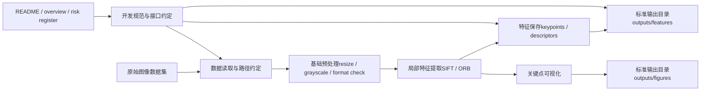

# 图像检索系统项目总览（overview）

## 1. 先回答你的问题：这样开发会不会更好？

会，而且这比“直接开写代码”要稳得多。

你现在形成的是一种更成熟的开发方式：

> **先做宏观分期规划（overview） → 再按阶段拆 issue → 再确定每个 issue 的具体任务与验收标准 → 再开始实现。**

这套方法有几个明显好处：

1. **和课程工期对齐**：不会写着写着偏离老师PPT主线；
2. **和工程实现对齐**：每个阶段都有明确输入、输出、依赖关系；
3. **和 Git / Issue 工作流对齐**：你后面可以按阶段建 milestone、按模块建 issue、按 issue 开分支；
4. **和实验记录对齐**：每个阶段都能留下文档、结果、失败点，而不是只留下零散代码；
5. **把“完整规划”和“最小闭环”统一起来**：图先画全，阶段先排清，代码只做当前阶段该做的最小闭环。

所以我赞成你现在的做法。

------

## 2. 当前总原则

本项目采用两层开发策略：

### 2.1 上层：宏观规划驱动

先明确：

- 总体目标是什么；
- 整体 pipeline 是什么；
- 每个工期做什么；
- 哪些阶段是传统主线，哪些阶段是增强主线；
- 各阶段产出物是什么。

### 2.2 下层：阶段闭环驱动

每个工期只追求一个**可运行的小闭环**，不提前做后面阶段的事情。

例如：

- 工期1只解决“系统骨架”；
- 工期2只解决“数据预处理”；
- 工期3只解决“局部特征提取”；
- 不在工期3去提前写 query expansion。

------

## 3. 第一阶段开发图（First-stage Development Diagram）

下面这张图不是整个最终系统，而是**你现在真正该做的第一阶段图**。

目标是：

> 先把“项目骨架 + 数据输入 + 局部特征提取 + 结果保存与可视化”打通。

### 3.1 这张图的含义

第一阶段并不做完整检索系统，只做四件核心事情：

1. **把数据输入约定好**；
2. **把预处理流程约定好**；
3. **把局部特征提取跑通**；
4. **把输出格式、目录结构、文档规范约定好**。

这一步完成后，你才真正拥有了后续编码、倒排索引、重排的起点。

------

## 4. 宏观开发工期规划

下面采用你提出的“工期0、工期1、工期2……”方式组织。这个版本是**宏观规划版**，用于 overview；后面你再把每个工期细化成 issue。

------

## 工期0：项目初始化与工程基建

### 目标

在真正进入算法开发前，完成项目的工程底座。

### 主要内容

- 初始化仓库基础结构；
- 建立 `README.md`、`overview.md`、风险记录文档；
- 设计目录结构；
- 设计配置文件结构；
- 设计日志、输出、实验记录目录；
- 约定代码风格、命名方式、数据路径组织方式；
- 明确 issue / branch / commit 的基本工作流。

### 产出物

- 清晰的目录树；
- overview 文档；
- risk register；
- base config；
- 可持续扩展的工程骨架。

### 验收标准

- 仓库能让后续模块直接接入；
- 文档说明清楚项目目标、分期计划、目录含义；
- 不再需要反复讨论“代码放哪、输出放哪、日志放哪”。

------

## 工期1：系统搭建（System Skeleton）

### 目标

搭建一个最小可运行的系统骨架，而不是完整算法系统。

### 主要内容

- 实现基础脚本入口；
- 打通配置读取；
- 打通数据读取；
- 建立模块接口：dataset / features / utils / visualization；
- 实现最小 demo 流程：读图 → 预处理 → 输出中间结果。

### 产出物

- 一套可运行的脚本入口；
- 数据加载与配置系统；
- 一版系统骨架图与模块接口说明。

### 验收标准

- 运行脚本不报结构性错误；
- 系统具备后续插入算法模块的骨架；
- 可以清晰说明每个模块未来挂接位置。

------

## 工期2：数据预处理（Data Preparation）

### 目标

把数据层先整理干净，保证后续特征提取和检索输入稳定。

### 主要内容

- 数据集目录规范化；
- query / gallery / train / val 等划分；
- 图像格式检查；
- resize、颜色空间、归一化等预处理策略；
- 去重、损坏样本检查；
- 生成数据清单文件。

### 产出物

- 干净的数据集组织；
- 数据清单与 split 文件；
- 数据预处理脚本。

### 验收标准

- 所有后续模块都可以统一读入数据；
- 输入图像格式稳定，不再因数据脏问题频繁报错；
- 数据划分方案可以写入实验记录。

------

## 工期3：局部特征提取（Local Feature Extraction）

### 目标

完成局部特征路线的真正起点。

### 主要内容

- 选定一版局部特征方法（建议先 SIFT 或 ORB）；
- 对图像提取 keypoints 与 descriptors；
- 保存标准格式输出；
- 做关键点可视化；
- 对少量样例检查特征质量。

### 产出物

- 局部特征提取脚本；
- keypoints / descriptors 文件；
- 关键点可视化图片。

### 验收标准

- 输入图像可稳定输出局部特征；
- 输出格式可被后续编码模块直接读取；
- 有一组样例图可以展示提取结果。

------

## 工期4：特征编码（Feature Encoding）

### 目标

把局部描述子变成可检索表示。

### 主要内容

- 收集局部描述子样本；
- 训练 codebook（如 KMeans visual words）；
- 将图像局部描述子映射到 visual words；
- 生成词袋表示。

### 产出物

- codebook；
- visual word 映射结果；
- BoW 表示文件。

### 验收标准

- 任一图像可从 descriptors 转为 visual words；
- 表示结果可被 tf-idf 和倒排模块读取。

------

## 工期5：TF-IDF 表示构建

### 目标

为倒排召回准备加权表示。

### 主要内容

- 统计 visual words 频率；
- 构建 tf-idf 表示；
- 设计存储格式与相似度计算接口。

### 产出物

- 图像级 tf-idf 表示；
- 对应存储文件与加载接口。

### 验收标准

- query 和 gallery 都能生成 tf-idf 表示；
- 表示质量可用于检索测试。

------

## 工期6：倒排索引（Inverted Index）

### 目标

实现传统主线下的高效初始召回。

### 主要内容

- 构建倒排表；
- 支持 query 检索；
- 输出 TopK 初始结果；
- 跑通从 query 到初排结果的第一个传统检索闭环。

### 产出物

- 倒排索引模块；
- 初始检索 demo；
- TopK 检索结果展示。

### 验收标准

- 输入 query 图像可返回检索结果；
- 系统达到“传统检索最小闭环”。

------

## 工期7：期中系统验收准备

### 目标

收束前面工期内容，形成可演示的传统主线版本。

### 主要内容

- 修补 bug；
- 统一展示输出；
- 补齐文档与阶段总结；
- 准备期中展示材料。

### 产出物

- 期中版本；
- 演示脚本；
- 阶段总结文档。

### 验收标准

- 可演示：从输入 query 到输出结果全流程通；
- 可说明：每个模块做了什么、后面还要做什么。

------

## 工期8：重排序（Re-rank）

### 目标

提升 Top 结果质量。

### 主要内容

- 局部精匹配；
- RANSAC 几何验证；
- 设计重排分数；
- 输出匹配点和内点可视化。

### 产出物

- rerank 模块；
- 匹配点可视化；
- 重排前后对比。

### 验收标准

- 前几名结果可见改善；
- 可解释性明显提升。

------

## 工期9：查询扩展（Query Expansion）

### 目标

提升召回与整体排序效果。

### 主要内容

- 选择高置信候选；
- 设计保守 QE 策略；
- 做 QE 前后实验对比。

### 产出物

- QE 模块；
- 对比实验记录。

### 验收标准

- QE 不明显引入漂移；
- 指标或展示有可见提升。

------

## 工期10：哈希 / 压缩 / 性能优化

### 目标

提升检索速度、降低存储成本。

### 主要内容

- 特征压缩 / 哈希尝试；
- 检索效率测试；
- 索引空间与速度对比。

### 产出物

- 加速实验；
- 性能对比记录。

### 验收标准

- 至少有一组速度 / 空间优化结果可展示。

------

## 工期11：深度全局特征路线（Dense Global Retrieval）

### 目标

构建现代增强路线。

### 主要内容

- 选择一版全局深度特征（如 CLIP / DINO）；
- 提取全局 embedding；
- 建立稠密向量检索；
- 输出 dense recall 结果。

### 产出物

- 全局特征模块；
- 稠密检索模块；
- dense baseline。

### 验收标准

- query 可以通过全局特征检索得到结果；
- 能与传统路线形成对比。

------

## 工期12：混合召回与融合（Hybrid Retrieval）

### 目标

形成你真正想要的“混合系统”。

### 主要内容

- sparse recall 与 dense recall 融合；
- 设计候选合并与分数归一化；
- 做融合前后对比实验。

### 产出物

- hybrid retrieval 模块；
- 融合实验结果。

### 验收标准

- 系统具备双路召回；
- 混合路线比单一路线更合理或更强。

------

## 工期13：系统收束与期末验收准备

### 目标

把系统从“能跑”变成“能交付、能答辩、能写报告”。

### 主要内容

- 统一接口；
- 补齐实验表格；
- 梳理失败案例；
- 打磨展示效果；
- 整理报告、PPT、答辩材料。

### 产出物

- 最终系统版本；
- 实验与消融结果；
- 最终汇报材料。

### 验收标准

- 系统可完整演示；
- 论文式与工程式叙述都成立；
- 你能清楚讲出每个阶段的演化关系。

------

## 5. 阶段依赖关系（非常重要）

这个 overview 还隐含一个重要原则：

- 工期0 是工期1-13 的工程前提；
- 工期1-3 是传统路线的地基；
- 工期4-6 形成传统检索闭环；
- 工期8-9 负责把传统系统做强；
- 工期11-12 负责把系统升级为混合系统；
- 工期13 负责把系统变成可答辩成果。

也就是说：

> **先有传统主线可运行版本，再做增强；先有单路可运行版本，再做混合。**

------

## 6. 你接下来该怎么用这份 overview

推荐你接下来的动作顺序是：

### 第一步：基于本 overview 建 milestone

例如：

- Milestone 0：Project Bootstrap
- Milestone 1：System Skeleton
- Milestone 2：Data Preparation
- Milestone 3：Local Features
- ...

### 第二步：每个工期拆 issue

每个工期拆成：

- 文档类 issue
- 代码类 issue
- 验证类 issue
- 可视化 / 演示类 issue

### 第三步：为每个 issue 写清楚

- 背景
- 目标
- 输入输出
- 依赖
- 验收标准

### 第四步：严格执行“当前工期只做当前闭环”

这样可以防止开发早期就失控。

------

## 7. 当前结论

当前最合理的开发方式是：

> **用 overview 管宏观节奏，用第一阶段开发图管当前落地，用 issue 管具体执行。**

这三层配合起来，既不会只停留在纸面规划，也不会一头扎进代码后失去方向。

这就是当前最稳、最适合课程项目、也最适合你个人风格的开发方式。